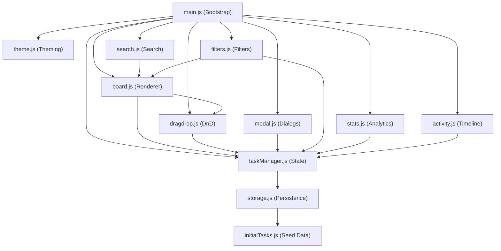

# TaskFlow Pro – Architecture Document

## Overview

TaskFlow Pro is an enterprise-grade Kanban board built entirely with vanilla HTML5, CSS3, and ES6+ JavaScript modules. It uses **zero external frameworks** (no React, no Vue, no jQuery, no Bootstrap, no Tailwind). The only external resources are Google Fonts and Font Awesome icons.

---

## Architecture Principles

| Principle | Implementation |
|---|---|
| **Separation of Concerns** | Each JS module owns exactly one domain (storage, state, rendering, drag-drop, search, etc.) |
| **Observer Pattern** | `taskManager` is the single source of truth; UI modules subscribe to its change notifications |
| **Unidirectional Data Flow** | User action → `taskManager` mutation → `notify()` → all subscribers re-render |
| **Persistence Layer Isolation** | Only `storage.js` touches `localStorage`; all other modules interact through `taskManager` |
| **Progressive Enhancement** | Core functionality works without CSS animations; animations are additive polish |

---

## Module Dependency Graph



---

## State Management Flow

```
┌─────────────┐     ┌──────────────┐     ┌──────────────┐
│  User Action │ ──▶ │ taskManager  │ ──▶ │  storage.js  │
│  (click/drag)│     │  .addTask()  │     │ localStorage │
└─────────────┘     │  .moveTask() │     └──────────────┘
                    │  .updateTask()│
                    │  .deleteTask()│
                    └──────┬───────┘
                           │ notify()
                    ┌──────▼───────┐
                    │  Subscribers  │
                    │  board.js     │
                    │  stats.js     │
                    │  activity.js  │
                    └──────────────┘
```

### Key Design Decisions

1. **Why Observer Pattern over Event Bus?**
   - Simpler to reason about. `taskManager.subscribe(fn)` is explicit.
   - No string-based event names to keep in sync.
   - Each subscriber receives the full state snapshot, preventing stale data.

2. **Why not MVC/MVVM?**
   - For a single-page Kanban board, full MVC adds unnecessary abstraction layers.
   - The observer-subscriber model gives us the reactivity benefits without the boilerplate.

3. **Why clone subtasks in modal?**
   - `modal.js` deep-clones subtask arrays before editing to avoid mutating live state.
   - Changes only commit to `taskManager` upon form submission, enabling cancel/discard.

---

## Drag & Drop Architecture

```
Desktop (HTML5 API)          Mobile (Touch Emulation)
─────────────────           ────────────────────────
dragstart → set dataTransfer   touchstart → clone card, store offsets
dragover  → e.preventDefault() touchmove  → position clone, highlight column
drop      → read dataTransfer  touchend   → find column under pointer
dragend   → cleanup            cleanup    → remove clone, clear highlights
                ▼                              ▼
         taskManager.moveTask(id, newStatus)
                ▼
         storage.saveTasks() + notify()
```

### Touch Drag Implementation
- A ghost clone of the card is created and positioned via `fixed` CSS.
- `document.elementFromPoint()` identifies the drop-target column.
- The clone is removed on `touchend` regardless of success.

---

## localStorage Schema

| Key | Type | Description |
|---|---|---|
| `taskflow_tasks` | `Array<Task>` | Full task objects with subtasks |
| `taskflow_activity` | `Array<ActivityItem>` | Capped at 50 entries |
| `taskflow_theme` | `string` | `"dark"` or `"light"` |

### Task Object Shape
```json
{
  "id": "task-1718800000000",
  "title": "string",
  "description": "string",
  "priority": "high | medium | low",
  "status": "todo | inprogress | done",
  "dueDate": "YYYY-MM-DD",
  "assignee": "string",
  "tags": ["string"],
  "subtasks": [
    { "id": "sub-xxx", "title": "string", "completed": boolean }
  ]
}
```

---

## CSS Architecture

| File | Responsibility |
|---|---|
| `variables.css` | Design tokens, HSL color system, theme-specific custom properties |
| `base.css` | Resets, typography, form controls, button components |
| `layout.css` | App grid, sidebar, header, metric cards, activity drawer |
| `board.css` | Kanban columns, task cards, drag states, progress bars |
| `modal.css` | Dialog overlays, forms, confirmation dialogs |
| `animations.css` | Keyframes, toasts, skeletons, command palette |
| `responsive.css` | Breakpoint queries, mobile column tabs, collapsible sidebar |

### Theming Strategy
- All colors reference CSS custom properties (`var(--bg-card)`, etc.).
- `:root.dark-theme` and `:root.light-theme` selector blocks swap all values.
- A `.theme-transitioning` class applies temporary `transition` to all properties for smooth switching.

---

## Accessibility

- All interactive elements have `aria-label` attributes.
- Modals use `role="dialog"` and `aria-modal="true"`.
- A `.sr-only` class hides labels visually while keeping them screen-reader accessible.
- Keyboard navigation: `N` (new task), `Escape` (close), `Ctrl+S` (save), `Ctrl+K` (search focus).
- Color contrast ratios target WCAG AA compliance.

---

## Performance Considerations

- **Render batching**: Board re-renders are triggered by a single `notify()` call, not per-property.
- **Animation budget**: CSS `will-change` is used sparingly on drag targets.
- **Storage writes**: Debounced implicitly (writes happen only on completed user actions, not on every keystroke).
- **Activity log cap**: Limited to 50 entries to prevent localStorage bloat.
- **DOM recycling**: Cards are fully rebuilt on state change rather than patched, which is acceptable for the typical Kanban scale (< 100 cards).
